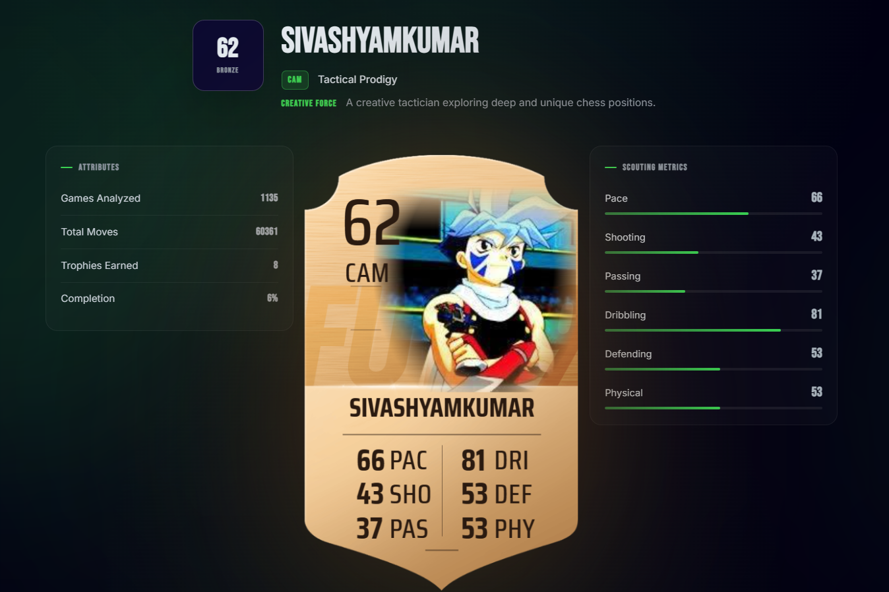

# Project Rosen: Ultimate Team

**A sleek, cross-platform chess achievement tracker that generates dynamic FIFA-style stat cards.**

---

## ♟️ What is Project Rosen?

Project Rosen is a specialized statistics tracker that scans your chess games for rare, creative achievements (inspired by IM Eric Rosen). We've taken the core accomplishment-tracking engine and wrapped it in a **premium, sleek, dark-mode interface**. 

The highlight? We calculate your unique stats across thousands of games and generate a **downloadable, FIFA Ultimate Team (FUT) style stat card** that evolves based on your chess career!

### ✨ Key Features

* **Dual Platform Fetching:** Seamlessly aggregates match data from both **Lichess** and **Chess.com**.
* **Realistic Stat Curves:** Advanced math curves ensure that while beginners can track their progress, maxing out your card (99 OVR) requires true dedication and tens of thousands of analyzed games.
* **Premium Aesthetics:** A complete UI overhaul featuring sleek dark themes, glassmorphism, glowing micro-animations, and dynamic data visualization.

---

## 🏆 The Tiered Card System

Your chess statistics are converted into a stunning, downloadable **FUT Card**. It features your avatar, country flag, overall rating, and core attributes (PAC, SHO, PAS, DRI, DEF, PHY).

As your score increases, your card visually upgrades through three distinct tiers—complete with glowing visual effects and premium textures!

  
### Gold Tier
*For the elite. Achieved at 85+ OVR.*  

  

### Silver Tier
*For dedicated players. Achieved at 65-84 OVR.*  

  

### Bronze Tier
*The starting point. Under 65 OVR.*  

---

## 🤝 Acknowledgements

This repository is a custom fork of the excellent [rosen-score](https://github.com/fitztrev/rosen-score) by **[fitztrev](https://github.com/fitztrev)**. Fitztrev engineered the core logic and achievement detection framework. This fork builds upon his brilliant work by introducing cross-platform capabilities, a new UI, and advanced stat-card generation algorithms.
