

# 👑 Project Rosen

**your entire chess legacy, condensed into a single 99-rated card** ♟️

  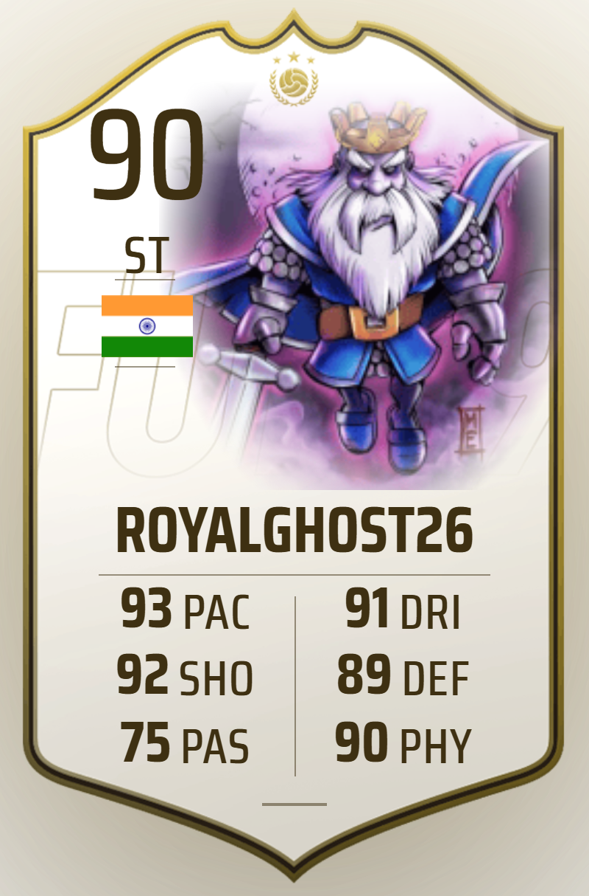
  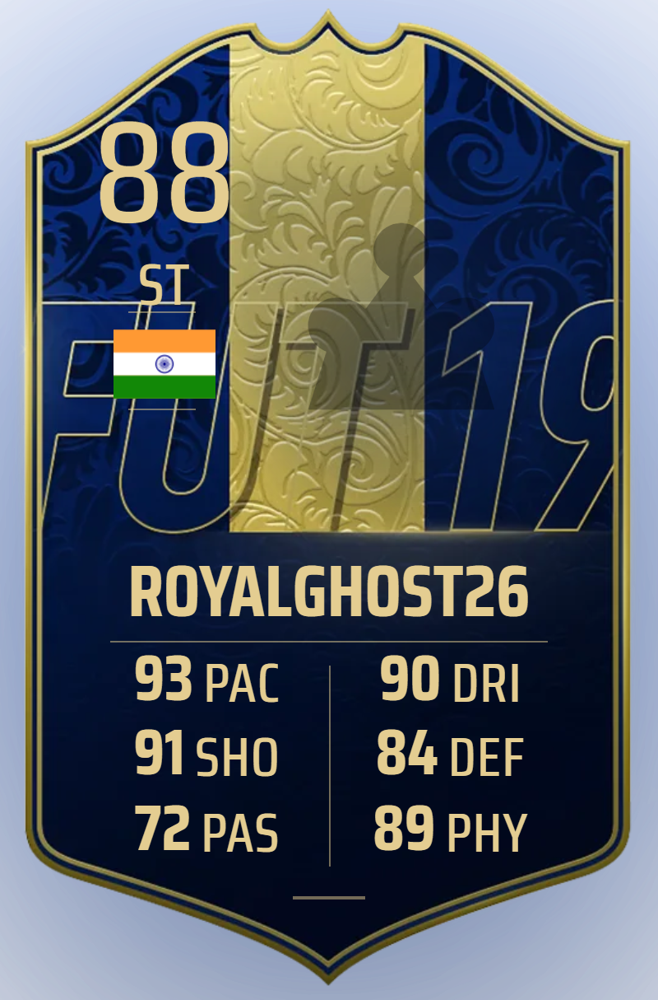
  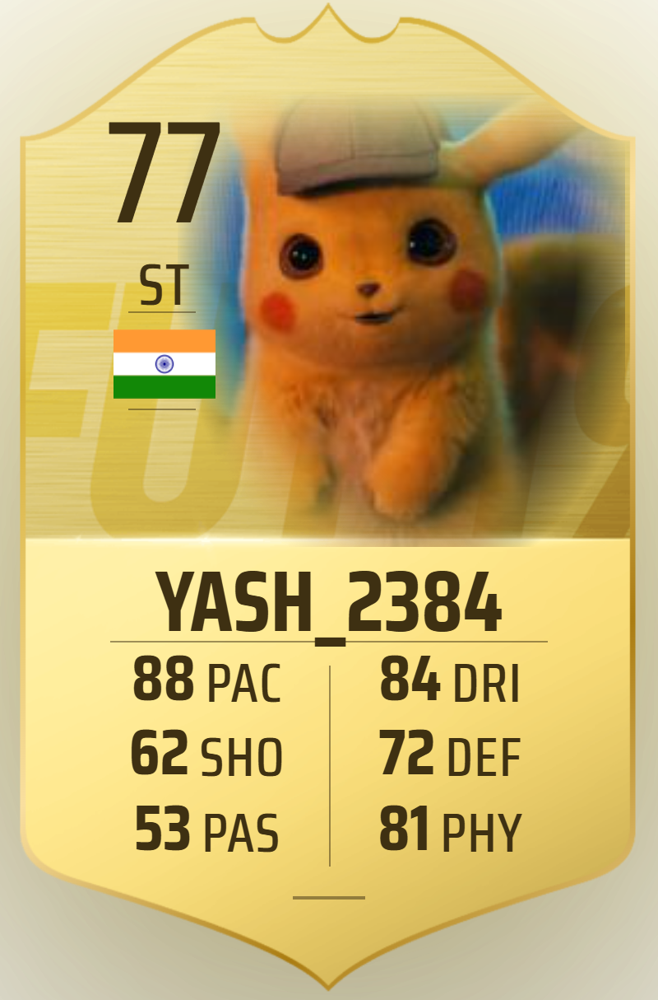
  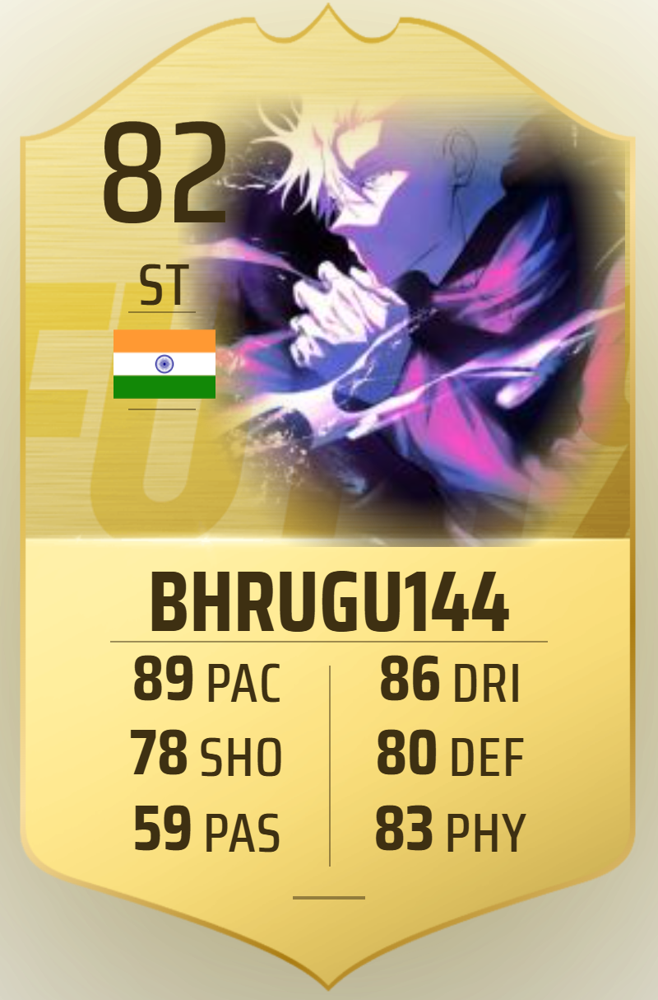

 

  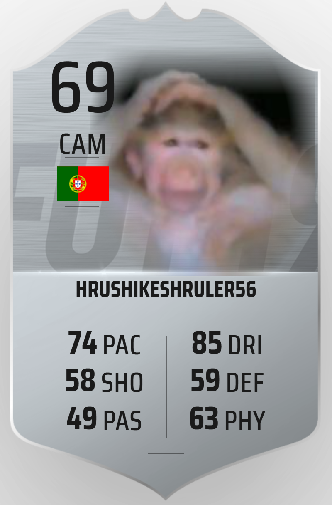
  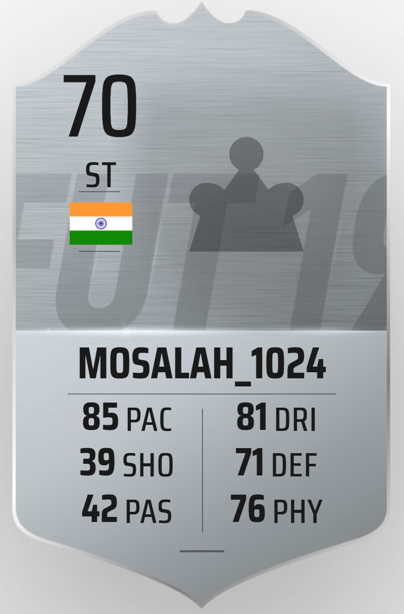
  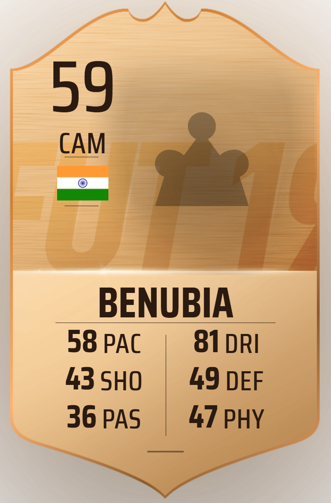

 

*Track your progress from a beginner (Bronze) all the way to a legendary Grandmaster (Icon).*

 

## ⚡ What is Project Rosen?

Forget standard Elo charts. **Project Rosen** is a specialized scouting engine that analyzes your raw games from **Chess.com** and **Lichess** to scout your true playing style. We crunch the numbers behind your tactics, game volume, endurance, and completion rates to generate a highly detailed, premium FUT-style player card. 

The ultimate flex? It re-scouts itself dynamically as you play more games!

 

## 🧠 The Scouting Engine

We map real chess metrics directly onto six core football attributes. There is no self-reporting—everything is strictly calculated from the raw API data of your historic chess matches.

| Attribute | Meaning | Scouted From |
| :---: | :--- | :--- |
| **PAC** | Pace | Game Volume & Lightning Grinds |
| **SHO** | Shooting | Trophies & Tournaments Won |
| **PAS** | Passing | Move Accuracy & Game Completion |
| **DRI** | Dribbling | Tactical Diversity & Complexity |
| **DEF** | Defending | Total Moves Survived |
| **PHY** | Physical | Lifetime Match Endurance |

Your **Overall (OVR)** is the headline stat. Hitting 99 isn't a walk in the park—our advanced scaling ensures the highest tiers are reserved for players who dedicate years to the game.

 

## 🃏 The 6 Legendary Tiers

Your card visually evolves as your overall rating climbs. Every single tier features distinct background art, dynamic inner glows, and a shiny metallic gradient border that traces the card's exact shape.

### 🩸 The Elusive In-Form Card

*Notice a massive stat spike? If one of your attributes is 20+ points higher than your overall rating, you'll unlock the ultra-rare **In-Form** card!*

   
  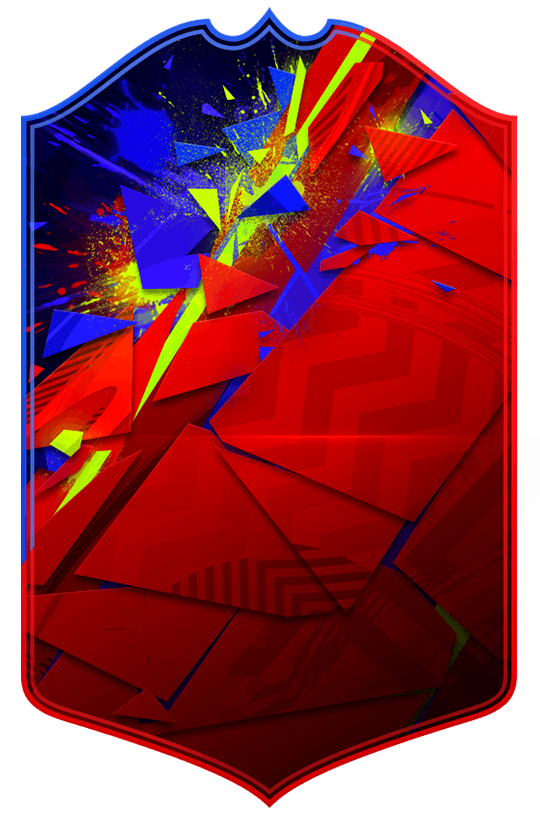
    
  <em>We haven't found a single player who has unlocked this yet... Can you be the first?</em>

 

### Full Scout Reports

*Every generated card comes paired with a full, detailed breakdown of exactly how each stat was calculated based on your historic chess data.*

  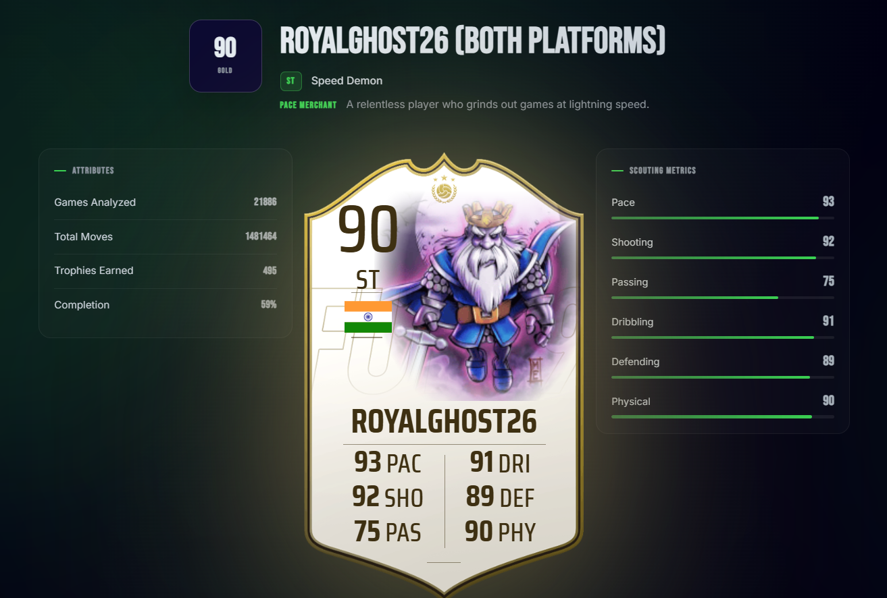
    
  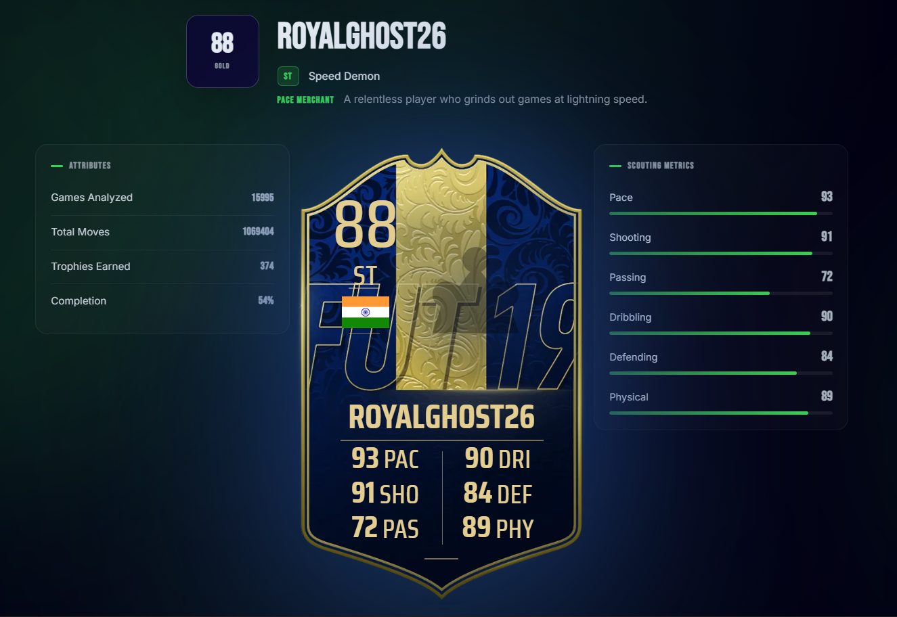
    
  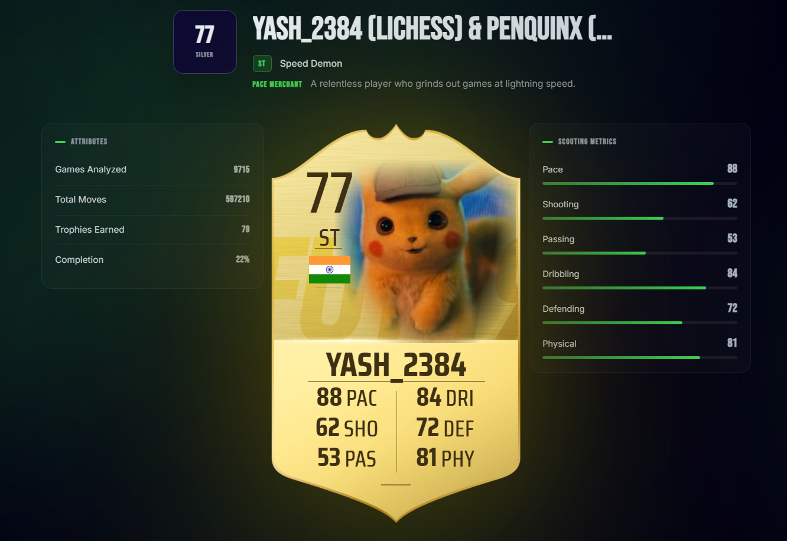
    
  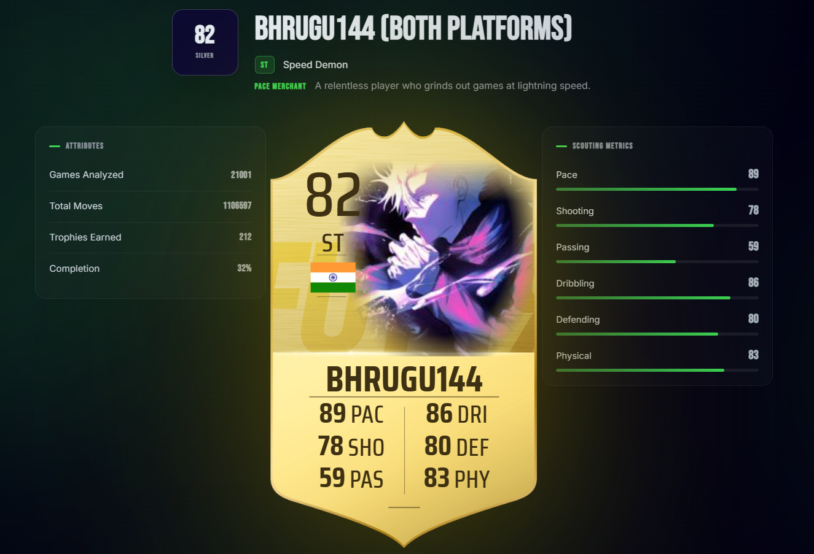
    
  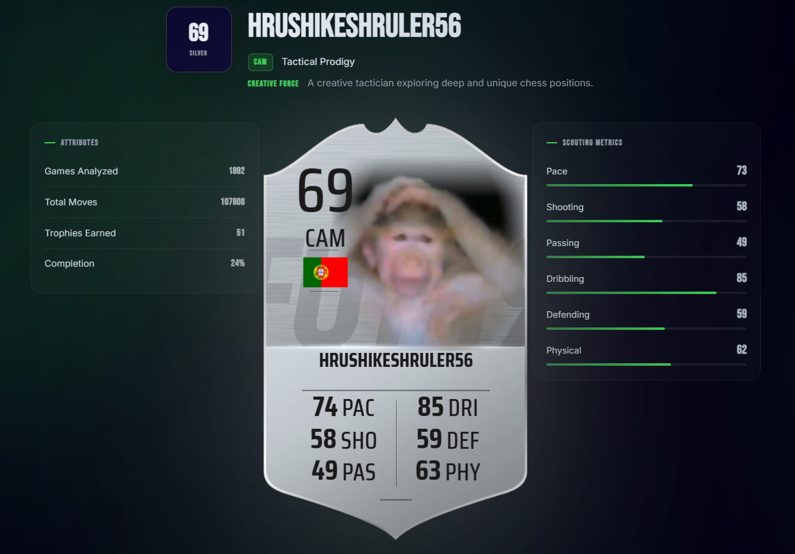
    
  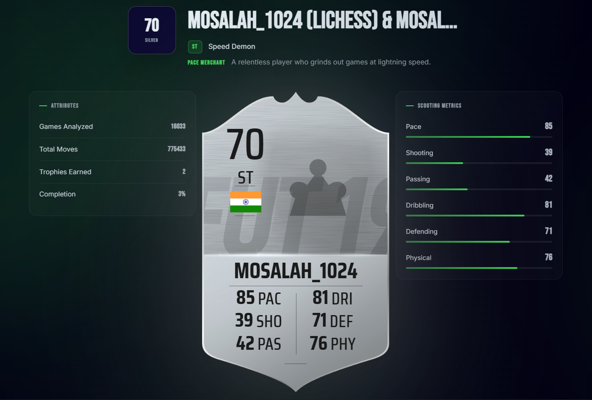
    
  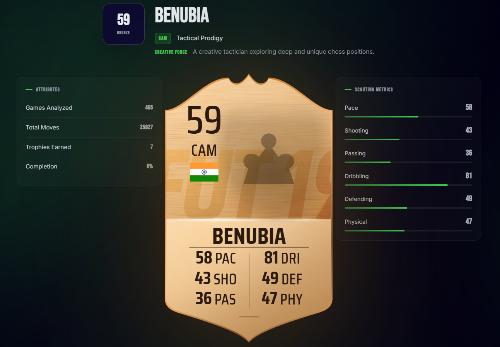

 

**Built with** Vue 3 · TypeScript · Tailwind · Vite

*Originally inspired by the amazing [rosen-score](https://github.com/fitztrev/rosen-score) by fitztrev.*

