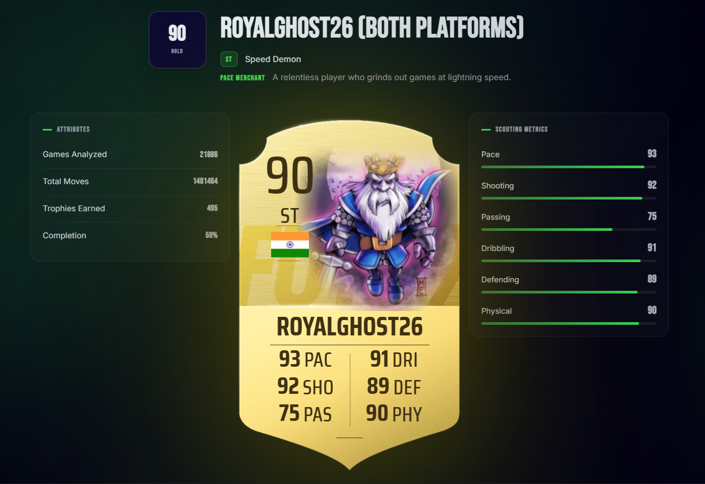
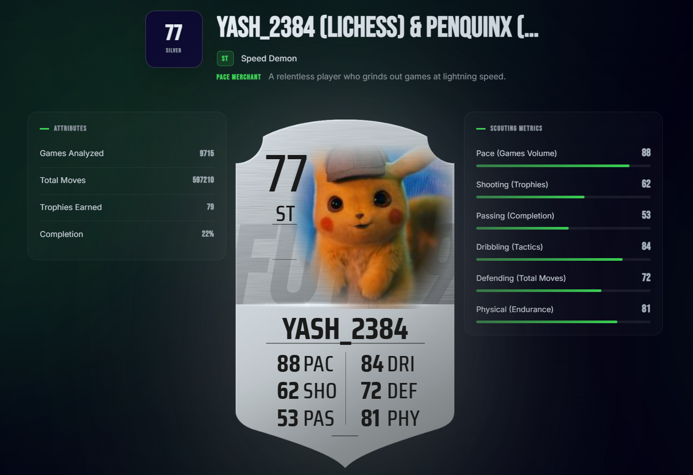

<div align="center">

# Project Rosen

**your Chess career, rated out of 99** ♟️


<br/><br/>





<br/><br/>

</div>

<br/>

## 🃏 &nbsp;Embed your card

Your card lives at a URL. Drop it in your profile README, your portfolio, anywhere — and it **re-scouts itself** as your stats change.

```md
[](https://project-rosen.vercel.app/username)
```

| | |
|---|---|
| **`project-rosen.vercel.app/<username>.png`** | your card, as a live image |
| **`project-rosen.vercel.app/<username>`** | the full scout report |
| **`?platform=chess.com`** | specify the platform |

<br/>

## ⚙️ &nbsp;How the scouting works

Six signals from a live chess profile, each mapped to a football stat — read straight from Lichess and Chess.com APIs. No surveys, no self-reporting. Just the games.

| | Stat | Scouted from |
|:--:|:--|:--|
| **PAC** | Pace | Games Volume |
| **SHO** | Shooting | Trophies |
| **PAS** | Passing | Completion |
| **DRI** | Dribbling | Tactics |
| **DEF** | Defending | Total Moves |
| **PHY** | Physical | Endurance |

Your **overall** is the headline. Raw stats cap at **88** — the 90s are a legacy gate, earned with years and influence, so one heroic year won't crown you an Icon. 

Every card walks out in a finish:

<div align="center">


</div>

<br/>

<div align="center">

**Built with** Vue 3 · TypeScript · Tailwind · Vite

scout someone today


</div>
